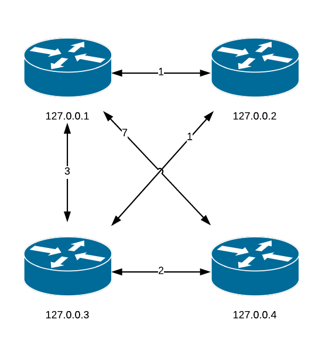
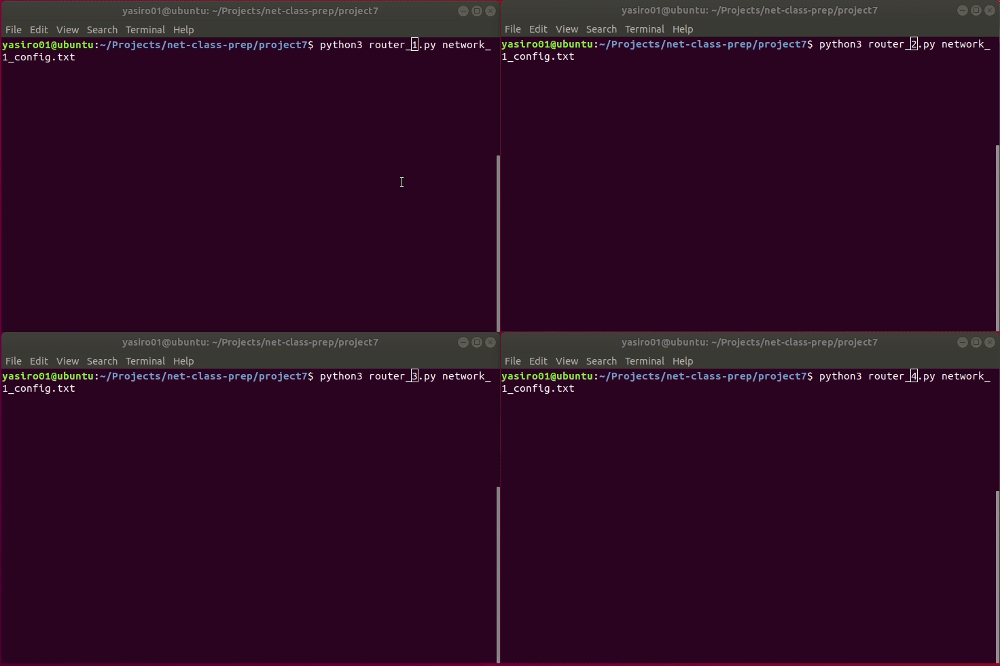

# Trivial Routing Protocol

## Task

In this project you will be writing a set of procedures to implement a distributed asynchronous distance-vector routing protocol. Eventually we'll try to make all the routers work together in the lab environment. In order to achieve general compatibility, it's mandatory that you use **Ubuntu 18.04** as a platform and **Python 3.6** as the implementation language.

I recommend you implement your router application in stages, from a basic socket application to a full-fledged router.

This is going to be a challenging project, not only in the sense of correctly implementing the distance-vector routing algorithm but also because your program must handle multiple connections that will operate asynchronously. There are several approaches to correctly deal with a bunch of asynchronous sockets, we are going to use the Python `select` method. The `select` method takes three lists, (sockets I want to **read from**, sockets I want to **write to**, sockets that might have **errors**) and checks all of the sockets lists. When the function returns (either right away, or after a set time), the lists you passed in will have been transformed into lists of sockets that you may want to read, write or check for errors respectively. You can be assured that when you make a read or write call, the call will not block.

I would strongly suggest that you take the time to write yourself a high-level design for this project before you start writing code. You may also find it useful to write a little server program that keeps multiple connections active and adds messages to a queue. Doing something very simple like this is a good way to learn and check out the problems you are likely to run into with asynchronous communications before you get mired in the whole distance-vector routing.

Each router should maintain a set of NEIGHBORS (adjacent routers) and a ROUTING_TABLE as a dictionary in the following format:

```python
{'destination':[cost, 'next_hop']}
```

## Stage 1: Read the Configuration File

We start with a simple application that reads a router's configuration from a text file, displays its status (neighbors and cost of getting to them), and starts listening for incoming UDP connections on port 4300. The configuration contains names of your directly connected neighbors and the cost to reach those neighbors.

You should write 4 identical files, each one for a different address (127.0.0.**x**) and port (4300**x**). By the end of the project you should be able to test your routers locally, at the very least.

### Configuration file format

```
Router_1_IP_address
Neighbor_1_IP_addres Cost_of_getting_to_neighbor_1
Neighbor_2_IP_addres Cost_of_getting_to_neighbor_2

Router_2_IP_address
Neighbor_1_IP_addres Cost_of_getting_to_neighbor_1
Neighbor_2_IP_addres Cost_of_getting_to_neighbor_2
Neighbor_3_IP_addres Cost_of_getting_to_neighbor_3
```

File *network_1_config.txt* represents the following network:



## Stage 1: Welcome to the Party

Start with a socket application that reads network configuration from a file, binds to port 4300, and prints the routing table.

### Stage 1 Functionality

1. Read the configuration file
2. Pick an appropriate address
3. Display the chosen router's neighborhood (names and costs)
4. Start listening on **UDP** port 4300

## Stage 2: Close Encounters of the Third Kind

1. Your program must connect to the IP addresses specified in the configuration file. Your client should accept a path to the configuration file as a command line argument so that we can try out a couple of different configurations. Note that in order to bootstrap the network you are going to need to have your program retry connections that fail.

2. Your program must also accept incoming IP connections from neighbors which may inform you of a link cost change, or may ask you to deliver a message to a particular IP address.

3. Our protocol will use the following types of messages:

* **UPDATE (0)**
* **HELLO (1)**

You should use `bytearray` or `struct` to format and parse messages.

### UPDATE message format

* The first byte of the message (0): 0

* Next four bytes (1-4): IP address

* The next byte (5): cost

* The same pattern (IP address followed by cost) repeats. 

```
0       7 8     15 16    23 24    31 32    39 
+--------+--------+--------+--------+--------+
|  Type  |           IP Address 1            |
+--------+--------+--------+--------+--------+
| Cost 1 |           IP Address 2            |
+--------+--------+--------+--------+--------+
| Cost 2 |     Another record ...
+--------+--------+--------+--------+--------+
```

### HELLO message format

* The first byte of the message (0): 1

* Next four bytes (1-4): source IP address

* Next four bytes (5-8): destination IP address

* The rest of the message (9+): text (characters)

```
0       7 8     15 16    23 24    31 32    39 
+--------+--------+--------+--------+--------+
|  Type  |        Source IP Address          |
+--------+--------+--------+--------+--------+
|  Destination IP Address           |  Text
+--------+--------+--------+--------+--------+
|  Continuation of message text
+--------+--------+--------+--------+--------+
```

### Event loop

1. Do we have pending connections?

    1. Accept new connections

    2. Add to the listener list

    3. Add IP addresses to the neighbor list

2. Process incoming messages

    1. If UPDATE, then update the routing table
        * Does my vector change?  If so, then set flag to `update_vector`
        * Print the updated routing table

    2. If DELIVERY, then forward to the destination

    3. If STATUS, then respond with the routing table

3. Is `update_vector` flag set?

    1. Send the new vector to all neighbors that can accept data

4. Check my neighbor list against the list of currently connected neighbors

    1. If missing neighbors, then try to initiate connections to them

    2. If successful, then add the new neighbor to list

    3. Send the new neighbor my distance vector

### Stage 2 Functionality

1. Read the configuration file name as a command line parameter
2. Read the neighborhood information from the configuration file
3. Send a router's table to all neighbors
4. Receive updates from the neighbors
5. Keep listening and be ready to update the routing table

## Stage 3: Routing

Write the following routing functions.

* Read a configuration file for your specific router and add each neighbor to a set of neighbors.

* Build an initial routing table as a dictionary with nodes as keys. Dictionary values should be a distance to the node and the next hop address. Initially, the dictionary must contain your neighbors only.

```python
{'destination':[cost, 'next_hop']}
```

* Format the update message based on the values in the routing table and return the message. For example, a message advertising routes to **127.0.0.1** of cost **10** and to **127.0.0.2** of cost **5** is the following `bytearray`:

```
0x0 0x7f 0x0 0x0 0x1 0xA 0x7f 0x0 0x0 0x2 0x5
```

* Parse the update message and return `True` if the table has been updated. The function must take a message (raw bytes) and the neighbor's address and update the routing table, if necessary.

* Print current routing table. The function must print the current routing table in a human-readable format (rows, columns, spacing).

* Parse a message to deliver. The function must parse the message and extract the destination address. Look up the destination address in the routing table and return the next hop address.

* Router works with properly implemented routers of other students.

## Functions

### read_file(filename)

* Read a configuration file for your specific router and add each neighbor to a set of neighbors.
* Build an initial routing table as a dictionary with nodes as keys.
* Dictionary values should be a distance to the node and the next hop address (ie. {'destination':[cost, 'next_hop']}).
* Initially, the dictionary must contain your neighbors only.

### format_update_msg()

* Format the update message based on the values in the routing table.
* The message advertising routes to 127.0.0.1 of cost 10 and to 127.0.0.2 of cost 5 is a bytearray in the following format
```
0x0 0x7f 0x0 0x0 0x1 0xA 0x7f 0x0 0x0 0x2 0x5
```
* The function must return the message.

### update_table(msg, neigh_addr)

* Parse the update message.
* The function must take a message (raw bytes) and the neighbor's address and update the routing table, if necessary.
* The function must return True if the table has been updated.

### print_status()

* Print current routing table.
* The function must print the current routing table in a human-readable format (rows, columns, spacing).

### deliver_msg()

* Parse a message to deliver.
* The function must parse the message and extract the destination address.
* Look up the destination address in the routing table and return the next hop address.

### send_update(node)

* Send updated routing table to the specified node (router)

## Running the simulation

Start each router as follows:

```
python3 router_1.py network_1_config.txt
python3 router_2.py network_1_config.txt
python3 router_3.py network_1_config.txt
python3 router_4.py network_1_config.txt
```



### Capturing the traffic

Use the provided dissector *trivial_routing_protocol.lua* to see routing messages in Wireshark.

```
wireshark -X lua_script:trivial_routing_protocol.lua routing_capture.pcapng &
```

## Grading

Functionality | Points
---|---
Read network configuration file | 20
Display router's Distance Vector | 20 
Format UPDATE message | 20
Send UPDATE message to all neighbors, if necessary | 20
Receive UPDATE message from all neighbors | 20
Parse UPDATE message | 20
Update Distance Vector, if necessary | 20
Ignore incoming UPDATE message, if possible | 20
Format and send HELLO message | 20
Parse and forward/display HELLO message | 20
 | 
Total | 200

## References

* [socket — Low-level networking interface — Python 3.7.1 documentation](https://docs.python.org/3/library/socket.html)

* [select — Waiting for I/O completion — Python 3.7.1 documentation](https://docs.python.org/3/library/select.html)
